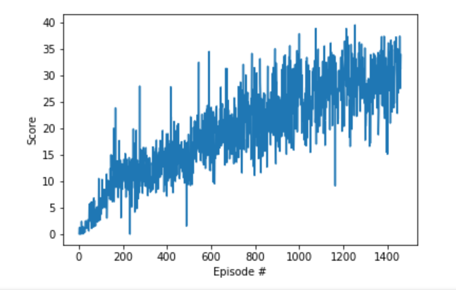

# Algorithm, HyperParameters and Neural Network Architecture

## Algorithm
The algorithm used for this project is DDPG, Deep Deterministic Policy Gradients, which has been shown to be very effective at solving continuous action space environments, like the Reacher environment.

In DDPG, an actor model and a critic model take in state information from the environment and together determine the best action for the agent to take. The information from each action is collected in a replay buffer that is then used for the agent to learn the best actions within the environment. In order to learn the agent samples from the replay buffer and then updates based on the information gathered in the replay buffer. The actor and the critic networks allow for a slow update of the policy, allowing the agent to improve over time.

## Hyperparameters
The hyperparameters for the algorithm were set as follows:
        
* Buffer Size 5e5
        
* Batch Size 128
        
* Gamma 0.99
        
* Tau 1e-3
        
* Learning Rate for Actor 2e-3
        
* Learning Rate for Critic 2e-4
        
* Weight Decay 0
        
* Learning steps (sets how often the gradient is updated-expressed in times per 20 timesteps) 10

## Neural Network Architecture
The neural network for this was smaller than that described in the [DDPG paper](https://arxiv.org/abs/1509.02971) with both the actor and the critic having 256 nodes in the first hidden layer and 128 nodes in the second hidden layer, with the critic having an additional layer of 64 nodes. RELU activation is used between the layers and optimized using the Adam optimizer.

## Plot of Rewards
The graph below plots the average rewards over 100 consecutive episodes. The environment was solved in 1361 episodes with an average score of 30.05.

## Ideas for Future Work
Trying this algorithm on the 20 arm version of the environment would be interesting. Specifically, it would be interesting to see whether or not any changes need to be made to account for the different arms, or would it just work by taking all of the input from each arm into the same actor and critic. Or, would it simply train faster because it has information from 20 arms to analyze instead of just one. Another experiment would be to see how the Crawler Unity environment could be adapted in order to deal with an environment involving an agent with multiple arms that have to work in concert in order to properly move around the environment.
